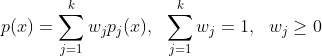

#  Разделение смеси распределений

В тех случаях, когда «форму» класса не удаётся описать каким-либо одним распределением, можно попробовать описать её смесью распределений.

 

где ) — функция правдоподобия -ой компоненты смеси,  — её априорная вероятность.

>**Априорная  (безусловная) вероятность** представляет собой степень уверенности в том, что данное событие произошло, в отсутствие любой другой информации, связанной с этим событием. Представление в задачах: вероятность принадлежности объекта  к классу  без учета его признаков.
>**Значение правдоподобия** - согласование (схожесть) с выборкой.

Иными словами, "выбрать объект x из смеси )" означает сначала выбрать -ю компоненту смеси из дискретного распределения , затем выбрать объект  согласно плотности ).
**Задача разделения смеси** - оценить вектор параметров, имея выборку,  смесь, количество распределений и функцию распределения.
## EM-алгоритм (expectation-maximization)
***Почему используем***
Принцип максимума правдоподобия «в лоб», приводит к слишком громоздкой оптимизационной задаче (долго решается).  
***Идея алгоритма***
Искусственно вводится вспомогательный вектор скрытых (hidden) переменных , обладающий двумя замечательными свойствами. 
EM-алгоритм состоит из итерационного повторения двух шагов. 
На -шаге вычисляется ожидаемое значение (expectation) вектора скрытых переменных  по текущему приближению вектора параметров . На -шаге решается задача максимизации правдоподобия (maximization) и находится следующее приближение вектора параметров по текущим значениям векторов  и .
### E-шаг (expectation)
Обозначим через ) плотность вероятности того, что объект  получен из -й компоненты смеси. По формуле условной вероятности

=p(x)P(\theta_j|x)=w_jp_j(x))

Введём обозначение ). Это неизвестная апостериорная вероятность того, что обучающий объект  получен из -й компоненты смеси. Каждый объект обязательно принадлежит какой-то компоненте, поэтому справедлива формула полной вероятности:
 для всех 
Тогда
}{\sum_{s=1}^k w_sp_s(x_i)})
### M-шаг (maximization)
M-шаг сводится к вычислению весов компонент  как средних арифметических и оцениванию параметров компонент  путём решения  независимых оптимизационных задач.Разделение переменных возможно благодаря удачному введению скрытых переменных.

